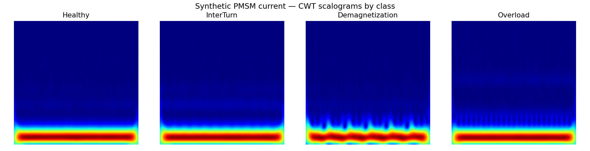

# PMSM Fault Diagnosis using Wavelet Scalograms and CNNs

[](https://github.com/molhamfetnah/pmsm-fault-diagnosis-cnn-scalogram/actions/workflows/ci.yml)
[](LICENSE)

A reproducible research pipeline that diagnoses faults in **Permanent Magnet
Synchronous Motors (PMSM)** by turning motor signals into **Continuous Wavelet
Transform (CWT) scalogram images** and classifying them with a **Convolutional
Neural Network (CNN)**.

> **Status.** Complete, tested (38 unit tests), and runs end-to-end without
> MATLAB. Trained and evaluated on the **real KAIST PMSM dataset**: vibration
> scalograms detect inter-turn stator faults at balanced-accuracy **1.00** on
> held-out recordings, current scalograms much lower (**0.69**). See §5 for the
> numbers and an important limitation (few healthy recordings).

Authors: **Mulham Fetna**, **Mohammad Zein Qabbani** — university research project.

---

## 1. Method

```
 signals ──► segment ──► CWT ──► scalogram PNG ──► CNN ──► fault class
 (current /            (window)  (Morlet)  (224×224)        Healthy / InterTurn /
  vibration)                                                Demagnetization / Overload
```

Signals come from three interchangeable sources, unified by a single
`data/manifest.csv` that links every signal segment → its scalogram → its label
and train/val/test split:

| Source | Channel(s) | Tooling | Status |
|---|---|---|---|
| **Synthetic generator** | current | Python (`python/simulate.py`) | included, runs anywhere |
| **Real datasets** | current + vibration | Python loaders | loaders ready; data downloaded by user |
| **Physics simulation** | current | MATLAB (FOC + Simscape) | scripts in `matlab/` |

Scalograms can be rendered either in **Python** (`python/scalogram.py`,
PyWavelets — no toolboxes needed) or in **MATLAB** (`matlab/scalogram/`, Wavelet
Toolbox). Both write the same `data/scalograms/<channel>/<class>/<id>.png` layout.

### Example scalograms (synthetic current)



The 50 Hz fundamental dominates the low-frequency band; the demagnetization and
overload signatures add visible sidebands and harmonics.

---

## 2. Quickstart

Requires **Python 3.10–3.12** (TensorFlow has no wheel for 3.13/3.14 yet).

```bash
make setup     # create .venv on python3.10 and install requirements
make test      # run the test suite (should be all green)
make demo      # synthetic end-to-end: simulate → scalograms → train → evaluate
```

`make demo` writes a trained model to `models/`, and metrics + a confusion
matrix to `results/`.

Run stages individually:

```bash
make simulate                       # synthetic signals  -> data/raw/sim/
make scalograms                     # CWT PNGs           -> data/scalograms/
make split                          # leakage-free splits in the manifest
make train SIGNAL=current EPOCHS=20 # -> models/cnn_current.keras
make evaluate SIGNAL=current        # -> results/confusion_current.png, report
make report                         # -> results/summary.md
```

---

## 3. Using real data

### 3.1 KAIST PMSM stator-fault dataset (recommended — current + vibration)

"Vibration and Current Dataset of Three-Phase PMSM with Stator Faults"
([Mendeley `rgn5brrgrn`](https://data.mendeley.com/datasets/rgn5brrgrn/5),
DOI `10.17632/rgn5brrgrn.5`, CC-BY-4.0). Current @ 100 kHz, vibration @ 25.6 kHz,
conditions: normal / inter-turn / inter-coil short, motors at 1.0/1.5/3.0 kW,
stored as `.tdms`.

```bash
# 1. Download .tdms files into data/raw/mendeley_pmsm/
#    (filenames like 1000W_0_00_current_interturn.tdms)
# 2. Ingest, decimating current 100 kHz -> target_fs:
.venv/bin/python -m python.ingest_mendeley
make scalograms split
make train SIGNAL=current   && make evaluate SIGNAL=current
make train SIGNAL=vibration && make evaluate SIGNAL=vibration
```

### 3.2 Inverter-fault dataset (Zenodo, tabular)

"Comprehensive Dataset for Fault Detection and Diagnosis in Inverter-Driven PMSM
Systems" ([Zenodo `13974503`](https://zenodo.org/records/13974503), CC-BY-4.0).
Useful as a real-world reference, **but sampled at 10 Hz** — too low for
meaningful scalograms — so it is documented in `docs/data-audit.md` rather than
wired into the CWT pipeline.

### 3.3 MATLAB physics simulation

`matlab/sim/` exports stator current from the Field-Oriented-Control model
(`FOC_PMSM-main/`) and the Simscape inter-turn fault model (`simscape-pmsm/`).
See `docs/superpowers/plans/2026-06-17-pmsm-cnn-scalogram.md` Phase 2 for the
exact steps and the model caveats (1 pole-pair validity, open-loop drive).

---

## 4. Repository layout

```
python/              # the pipeline (one responsibility per module)
  config.py          # config.yaml loader + validation
  manifest.py        # the data manifest (single source of truth)
  split.py           # leakage-free, group-wise, stratified train/val/test split
  simulate.py        # synthetic PMSM signal generator (MCSA fault signatures)
  ingest_sim.py      # ingest simulated/synthetic .npy signals
  ingest_real.py     # template loader for a generic real current dataset
  ingest_mendeley.py # loader for the KAIST TDMS dataset (current + vibration)
  ingest_vibration.py# template loader for a generic vibration dataset
  scalogram.py       # Python CWT scalogram rendering (PyWavelets)
  data_loader.py     # manifest -> tf.data pipeline
  model.py           # baseline CNN + dual-branch fusion CNN
  train.py           # training entrypoint
  evaluate.py        # confusion matrix + classification report
  experiments.py     # hyperparameter / overfitting grid
  report_metrics.py  # consolidated results/summary.md
  tests/             # pytest suite
matlab/              # MATLAB alternatives: CWT scalograms + FOC/Simscape export
docs/                # design spec, implementation plan, data audit, report/slides
FOC_PMSM-main/       # third-party Simulink FOC model (signal source)
simscape-pmsm/       # Simscape inter-turn fault model (separate git repo)
config.yaml          # all pipeline parameters
Makefile             # convenience targets
```

---

## 5. Results

### 5.1 Real data (KAIST PMSM, Healthy vs Inter-turn)

Trained and evaluated on the real **KAIST dataset** (Mendeley `rgn5brrgrn`,
1.0 + 1.5 kW), 3,150 scalogram segments. Train/val are **class-balanced** by
undersampling the majority class; the **test split keeps its natural
distribution** and uses **held-out recordings** (leakage-free, grouped by
`recording_id`). Because the test set is imbalanced (50 Healthy / 200
Inter-turn), the headline metrics are **balanced accuracy** and **2-class
macro-F1**, not raw accuracy.

| Channel              | Test acc | Balanced acc | Macro-F1 | Healthy recall | Inter-turn recall |
|----------------------|----------|--------------|----------|----------------|-------------------|
| **Vibration**        | **1.00** | **1.00**     | **1.00** | 1.00           | 1.00              |
| Fusion (cur.+vib.)   | 0.80     | 0.88         | 0.76     | 1.00           | 0.75              |
| Current              | 0.50     | 0.69         | 0.49     | 1.00           | 0.37              |


The **dual-branch fusion** model (`python/train_fusion.py`, pairs current+vibration
scalograms from the same condition/segment, condition-level leakage-free split)
lands between the two single channels: it lifts the weak current result but does
**not** beat vibration alone here — combining a strong and a weak channel did not
help on this small dataset, and its lighter global-average-pooling head isn't a
like-for-like comparison with the single-channel models. Run it with
`make train-fusion`.

**Real scalograms** (note how the inter-turn fault enriches the vibration
time-frequency content):


**What this shows.** *Vibration* scalograms separate healthy from inter-turn
faulty motors perfectly on held-out recordings, while *current* scalograms carry
a much weaker inter-turn signature at these severities (the current model catches
every healthy case but misses ~63 % of faults). Vibration being the stronger
channel for inter-turn detection is consistent with the motor-fault literature.

> **Limitation (important).** The dataset has only **4 distinct healthy
> recordings** (2 train / 1 val / 1 test). A perfect vibration score therefore
> cannot fully rule out the CNN keying on recording-specific characteristics
> rather than generalizable fault features. Confirming generalization needs more
> independent healthy recordings (more motors, loads, sessions). See
> `results/summary.md`.

### 5.2 Synthetic data (software validation, 4 classes)

On the **synthetic** generator (4 classes incl. Demagnetization & Overload, which
the real data lacks) the baseline CNN reaches **100 % test accuracy**. This only
confirms the *software pipeline is correct end-to-end* (signal → scalogram → CNN
→ metrics, no leakage) — **not** that the task is easy; the synthetic signatures
are deliberately separable. The pipeline is identical for synthetic and real
data; only the ingestion step differs.

---

## 6. Testing

```bash
make test          # or: .venv/bin/python -m pytest -q
```

Pure-logic modules (config, manifest, split, segmentation, filename parsing,
metrics, scalogram shape) are unit-tested. TensorFlow-dependent tests run when
TF is installed and skip cleanly otherwise.

---

## 7. Configuration

All parameters live in `config.yaml`: class set, channels, window length /
overlap, target sampling rate, image size, wavelet, number of CWT scales, RNG
seed, and paths. Every module reads from it — change behaviour there, not in code.

---

## 8. Citation & references

If you use the real datasets, cite their authors:

- KAIST PMSM stator-fault dataset — *Vibration and current dataset of
  three-phase PMSM with stator faults*, Data in Brief (2023). DOI
  `10.17632/rgn5brrgrn.5`.
- Inverter-fault dataset — Zenodo `10.5281/zenodo.13974503`.

Background reading and the full source list are in `references.md`; the design
rationale is in `docs/superpowers/specs/` and `docs/superpowers/plans/`.

## 9. License

Code: [MIT](LICENSE). Datasets retain their own (CC-BY-4.0) licenses.
