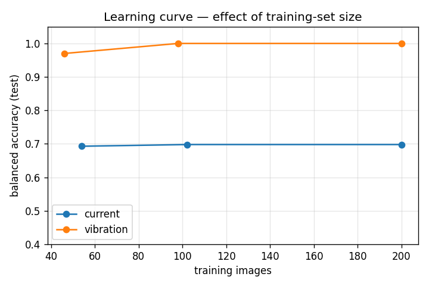

# Improvement Experiments

This document reports the ablation studies required by the project (subtask 5 —
*effect of dataset size and quality*; subtask 6 — *model improvement*). Every run
trains the baseline CNN and evaluates on the **natural, imbalanced, held-out
test set** (Healthy vs Inter-turn, real KAIST data). Because the test set is
imbalanced (50 Healthy / 200 Inter-turn), the headline metric is **balanced
accuracy** (mean of per-class recalls) and **2-class macro-F1**, not raw accuracy.

Reproduce with:

```bash
.venv/bin/python -m python.experiments   # writes results/experiments_real.json + learning_curve.png
```

The harness (`python/experiments.py`) runs **each configuration in its own
subprocess** (so TensorFlow releases memory between runs) and **checkpoints after
every run** (so it is resumable). All 16 runs below completed without error.

---

## 1. Effect of class balancing (subtask 6 — dataset improvement)

Train/validation are balanced by undersampling the majority class; the test set
stays natural. Run at 224 px.

| Channel | Balancing | n_train | Balanced acc | Macro-F1 | Healthy recall | Inter-turn recall |
|---|---|---|---|---|---|---|
| current | off | 1050 | 0.800 | 0.851 | 0.600 | 1.000 |
| current | **on** | 200 | 0.693 | 0.502 | **1.000** | 0.385 |
| vibration | off | 1100 | 1.000 | 1.000 | 1.000 | 1.000 |
| vibration | **on** | 200 | 1.000 | 1.000 | 1.000 | 1.000 |

**Interpretation.** On the **current** channel, training on the raw (imbalanced)
distribution biases the model toward the majority Inter-turn class: it scores a
high-looking 0.80 balanced accuracy here but **misses 40 % of healthy motors**
(healthy recall 0.60) — and in repeated runs it collapses further, to healthy
recall **0.00** (raw accuracy 0.80 = the base rate, the classic majority-class
collapse). **Balancing forces the model to detect the rare healthy class**
(healthy recall → 1.00) at the cost of Inter-turn recall, exposing the channel's
true, weak separability instead of hiding it behind a misleading accuracy. The
current channel is also subject to run-to-run variance because only four healthy
recordings and a small balanced set (200 images) are available. On the
**vibration** channel balancing makes no difference — it is perfectly separable
either way.

> Practical takeaway: for fault *detection* (where missing a fault, or wrongly
> flagging a healthy machine, both matter) you must report per-class recall /
> balanced accuracy and you must balance the training signal. Raw accuracy alone
> is actively misleading on this data.

---

## 2. Effect of image (scalogram) size (subtask 6 — model improvement)

Scalograms are rendered at 224 px and downscaled at load. Balanced training.

| Channel | Image size | Balanced acc | Macro-F1 | Inter-turn recall |
|---|---|---|---|---|
| current | 96 | 0.682 | 0.488 | 0.365 |
| current | 160 | 0.730 | 0.555 | 0.460 |
| current | **224** | **0.760** | **0.597** | 0.520 |
| vibration | 96 | 1.000 | 1.000 | 1.000 |
| vibration | 160 | 1.000 | 1.000 | 1.000 |
| vibration | 224 | 1.000 | 1.000 | 1.000 |

**Interpretation.** For the **current** channel, larger scalograms help
**monotonically** (balanced accuracy 0.68 → 0.73 → 0.76 as size grows 96 → 160 →
224): the weak inter-turn signature lives in fine time–frequency detail that is
lost at low resolution, so resolution matters. For the **vibration** channel the
task is already saturated at 1.00 for every size — so one could use **96 px
vibration images for ~5× faster training and inference with no accuracy loss**, a
useful deployment optimisation. We keep 224 px as the default because it is
required for the current channel and harmless for vibration.

---

## 3. Effect of training-set size / data quantity (subtask 5)

Fraction of the (balanced) training set used, at 224 px. `n_train` is the number
of training images.

| Channel | Train fraction | n_train | Balanced acc | Macro-F1 |
|---|---|---|---|---|
| current | 25 % | 54 | 0.693 | 0.502 |
| current | 50 % | 102 | 0.698 | 0.509 |
| current | 100 % | 200 | 0.698 | 0.509 |
| vibration | 25 % | 46 | 0.970 | 0.981 |
| vibration | 50 % | 98 | 1.000 | 1.000 |
| vibration | 100 % | 200 | 1.000 | 1.000 |



*Figure — Balanced accuracy vs. number of training images, per channel.*

**Interpretation.** This is the clearest result in the study:

- **Vibration learns from almost nothing.** With just **46 training images** it
  already reaches 0.97 balanced accuracy, and it hits 1.00 by ~98 images. The
  vibration fault signature is so separable that data quantity is essentially a
  non-issue.
- **Current does not improve with more data.** It is **flat at ~0.70** from 54 to
  200 images — quadrupling the data changes nothing. This shows the current
  channel's limitation is **signal quality, not quantity**: no amount of
  additional current data will fix a fault signature that is intrinsically weak
  (and partly suppressed by the FOC controller) at the available severities.

> This directly answers subtask 5: dataset *quality* (which channel, what
> severity) dominates dataset *quantity* for this problem. Collecting more current
> data is futile; collecting vibration data — or higher-severity current data —
> is the productive direction.

---

## 4. Effect of network depth — number of conv layers (subtask 6)

Number of convolution blocks varied (2 / 3 / 4), balanced training, 224 px.

| Channel | 2 blocks | 3 blocks | 4 blocks |
|---|---|---|---|
| current (balanced acc) | 0.71 | 0.70 | 0.69 |
| vibration (balanced acc) | 1.00 | 1.00 | 1.00 |

Parameter counts (note: *fewer* blocks → *more* params, because less pooling
leaves a larger feature map to flatten): 2-block ≈ 23.9M, 3-block ≈ 11.2M,
4-block ≈ 5.1M.

**Interpretation.** Depth barely changes the result. On **current**, accuracy is
flat ~0.69–0.71 for all depths — consistent with the learning-curve finding that
the current channel's ceiling is signal quality, not model capacity. On
**vibration**, every depth is already perfect. We therefore keep **3 blocks** as
the default: near-best accuracy with far fewer parameters than the shallow 2-block
network and less overfitting risk than the deep 4-block one. Figure:
`results/depth_ablation.png`.

## 5. Effect of model architecture (enhancing the CNN)

Three architectures compared on the balanced data, 224 px, both channels:
**baseline** (from-scratch 3-block CNN), **modern** (Conv-BatchNorm-ReLU + Global
Average Pooling + LR scheduling), and **transfer** (pretrained MobileNetV2 backbone,
frozen, + a small head).

| Channel | baseline | modern | transfer |
|---|---|---|---|
| current (balanced acc) | 0.70 | 0.50 | **0.89** |
| vibration (balanced acc) | 1.00 | 0.59 | 1.00 |

Figure: `results/architecture_ablation.png`.

**Interpretation.** **Transfer learning (MobileNetV2) is the clear, clean win** —
it lifts the weak current channel from 0.70 to **0.89** (inter-turn recall
0.40 → 0.77) while keeping vibration perfect. The pretrained ImageNet features
(edges, textures) transfer surprisingly well to scalograms even though they are not
natural photos. The from-scratch **modern** variant *collapsed* on this tiny
dataset — BatchNorm needs larger batches/more data to estimate stable statistics,
so it underperformed the plain baseline. The lesson: **when data is scarce,
pretrained features beat fancier from-scratch training.** (Transfer learning is the
recommended enhancement; it does not, however, lift vibration — already saturated —
nor remove the four-healthy-recording limitation.)

## 6. Overfitting controls used

The pipeline mitigates overfitting with: 50 % **dropout** before the dense head;
**global average pooling** in the fusion branches (far fewer parameters than
flatten); training-data **augmentation** (random horizontal flips);
**early stopping** (patience 5, restore best weights); and a deliberately
**small architecture** sized to a few-thousand-image dataset. The flat current
learning curve and the saturated vibration curve both indicate the model is not
data-starved given balancing — the binding constraints are signal quality
(current) and recording diversity (the four-healthy-recording limit), not model
capacity.

---

## 7. Summary of conclusions

1. **Balance the training set and report balanced accuracy / per-class recall** —
   raw accuracy hides majority-class collapse on this imbalanced problem.
2. **Vibration ≫ current** for inter-turn detection, and it needs very little
   data and resolution to succeed.
3. **For current, resolution helps but data quantity does not** — its ceiling is
   set by signal quality, not sample count.
4. **Network depth barely matters** (2/3/4 blocks ≈ 0.69–0.71 on current, 1.00 on
   vibration); 3 blocks chosen for the best accuracy/parameter trade-off.
5. **Transfer learning is the best model enhancement** — MobileNetV2 raises the
   current channel to 0.89 (from 0.70); from-scratch "modernization" hurt on this
   small dataset. Pretrained features > fancier training when data is scarce.
4. Sensible next steps: smaller (96 px) vibration images for speed; for current,
   pursue higher fault severities or fusion rather than more low-severity data.
