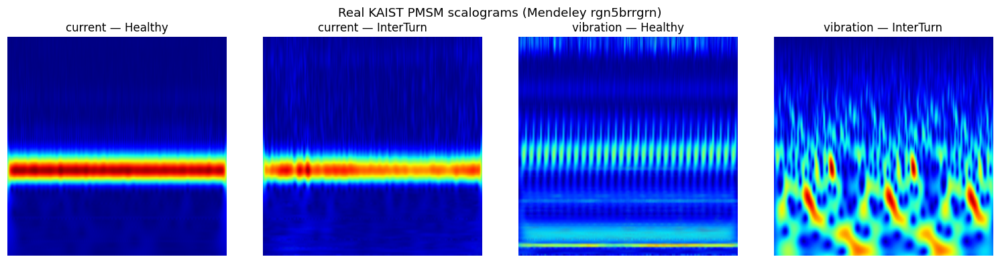
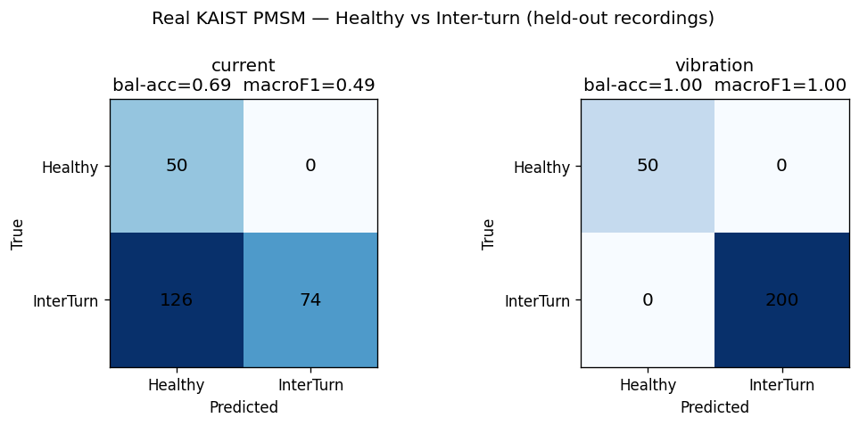

# استخدام الشبكات العصبية الالتفافية (CNN) لتحليل صور Wavelet Scalogram في تشخيص أعطال محركات PMSM

**«اسم الجامعة — الكلية»** · **«القسم / الاختصاص»**

إعداد الطالبين: **ملهم فتنة** · **محمد زين قباني**

إشراف: **«د. اسم المشرف»**  ·  العام الدراسي: **«2025–2026»**

---

## ١. المشكلة

- محركات **PMSM** تشغّل السيارات الكهربائية والروبوتات وأنظمة التحكم الصناعية ومُشغّلات الطيران.
- أكثر أعطال العضو الثابت شيوعاً — **القصر بين اللفات (inter-turn)** — قد يتطوّر إلى انهيار كامل للملف خلال دقائق.
- الهدف: **كشف الأعطال آلياً وباكراً** من إشارات المحرك نفسه.
- الطرق التقليدية (تحليل طيف التيار) تتطلّب خبيراً يعرف مسبقاً أيّ تردد يراقب، وتضعف عند تغيّر السرعة والحمل.

---

## ٢. الفكرة

تحويل مشكلة **الإشارة** إلى مشكلة **صورة**.

```
الإشارة ⟵ تقطيع ⟵ CWT ⟵ صورة Scalogram ⟵ CNN ⟵ تصنيف الحالة
(تيار/اهتزاز)        (مويجة Morlet) (224×224)        سليم / عطل بين اللفات
```

- الشبكة **تتعلّم** بصمات العطل بنفسها — دون هندسة سمات يدوية.
- قناتان مدروستان: **تيار العضو الثابت** و**الاهتزاز**.

---

## ٣. منظومة المعالجة

- **المصادر:** مجموعة بيانات KAIST الحقيقية (تيار + اهتزاز)، ومولّد إشارات اصطناعي، ومحاكاة MATLAB (FOC + Simscape).
- **ملف إعدادات واحد + بيان (manifest) واحد** يربط: إشارة ⟵ scalogram ⟵ تصنيف ⟵ تقسيم — قابل للتكرار بالكامل.
- مُنفَّذة بلغة Python (TensorFlow/Keras، PyWavelets)، دون الحاجة إلى MATLAB، مع **٣٨ اختبار وحدة + تكامل مستمر (CI)**.

---

## ٤. محرك PMSM وأعطاله

- PMSM: دوّار بمغناطيس دائم يتعقّب الحقل الدوّار للعضو الثابت ⟵ يدور **بشكل متزامن**، بلا انزلاق ⟵ كفاءة عالية.
- يُقاد عبر **التحكم الموجّه حقلياً (FOC)** — وحسّاسات التيار موجودة أصلاً في المُشغّل.
- الأعطال المدروسة:
  - **القصر بين اللفات** (الأساسي، بيانات حقيقية)
  - **إزالة المغنطة**، **الحمل الزائد** (اصطناعية)

---

## ٥. لماذا المويجات وليس فورييه؟

- تحويل فورييه **أعمى زمنياً** — لا يخبرنا *متى* يحدث التردد.
- إشارات الأعطال **غير مستقرة** (عابرة، تعتمد على الحمل).
- مبدأ عدم اليقين: `Δt · Δf ≥ ثابت` — يستحيل دقّة زمنية وترددية مثاليّتان معاً.
- **المويجات** = موجات قصيرة موضعية ⟵ دقّة ترددية متغيّرة، مثاليّة للظواهر العابرة.

---

## ٦. تحويل المويجات المستمر (CWT) ومخطط الطيف

- نُقيّس مويجة **Morlet** (مقبض التردد) ونُزلقها (مقبض الزمن).
- كلّ معامل = **تشابه** الإشارة مع تلك الموجة عند ذلك الزمن.
- **Scalogram** = صورة ملوّنة للطاقة مقابل الزمن (س) والتردد (ص).
- الحُزَم والنطاقات الجانبية الساطعة = بصمات العطل التي *تراها* الشبكة.

---

## ٧. أمثلة على المخططات (بيانات KAIST الحقيقية)



العطل بين اللفات يُثري محتوى الزمن–التردد في قناة **الاهتزاز** بوضوح.

---

## ٨. مجموعة البيانات

- **مجموعة KAIST لأعطال العضو الثابت** (Mendeley `rgn5brrgrn`، رخصة CC-BY-4.0).
- التيار بمعدّل **100 kHz**، الاهتزاز **25.6 kHz** ⟵ خُفّضا إلى 10 kHz.
- **3,150** مقطع scalogram (نوافذ 0.5 ثانية، تداخل 50%).

| القناة | سليم | عطل بين اللفات |
|---|---|---|
| تيار | 200 (4 تسجيلات) | 1350 (27 تسجيل) |
| اهتزاز | 200 (4 تسجيلات) | 1400 (28 تسجيل) |

---

## ٩. تقسيم خالٍ من التسرّب

- التقسيم حسب **التسجيل** لا حسب المقطع ⟵ لا نوافذ مترابطة بين التدريب/الاختبار (لا تسرّب بيانات).
- مُصنّف حسب الفئة، **لكل قناة**، بنسبة 70 / 15 / 15.
- انتباه خاص: **4 تسجيلات سليمة فقط** ⟵ نضمن تسجيلاً واحداً على الأقل في كل قسم ليكون كل صنف قابلاً للتقييم.

---

## ١٠. اختلال توازن الأصناف — القضية الجوهرية

- **4 تسجيلات سليمة** مقابل ~60 تسجيل معطوب.
- التدريب الساذج ⟵ النموذج يتنبّأ "معطوب" دائماً: **"دقة" 80% لكن كشف صفري للسليم**.
- الحل: **خفض عيّنة الأغلبية في التدريب/التحقق**، وإبقاء **الاختبار طبيعياً**.
- نُبلِّغ **الدقة المتوازنة** و **macro-F1**، لا الدقة الخام.

---

## ١١. بنية الشبكة العصبية الالتفافية

```
224×224×3
 → Conv32 → Pool → Conv64 → Pool → Conv128 → Pool
 → Flatten → Dropout(0.5) → Dense128 → Softmax
```

- المُحسِّن Adam، خسارة الإنتروبيا المتقاطعة، إيقاف مبكر، تعزيز بيانات.
- نموذج **الدمج (fusion)**: فرعان (تيار + اهتزاز) ⟵ تجميع متوسّط عام ⟵ دمج ⟵ طبقة كثيفة.

---

## ١٢. النتائج — بيانات حقيقية

| القناة | الدقة المتوازنة | macro-F1 | استدعاء السليم | استدعاء العطل |
|---|---|---|---|---|
| **الاهتزاز** | **1.00** | **1.00** | 1.00 | 1.00 |
| الدمج (تيار+اهتزاز) | 0.88 | 0.76 | 1.00 | 0.75 |
| التيار | 0.69 | 0.49 | 1.00 | 0.37 |

تسجيلات محجوزة للاختبار، التمييز: سليم مقابل عطل بين اللفات.

---

## ١٣. مصفوفات الالتباس



الاهتزاز مثالي؛ التيار يُخطئ معظم الأعطال؛ الدمج بينهما.

---

## ١٤. التحليل

- **الاهتزاز ≫ التيار** لكشف العطل بين اللفات — متوقّع فيزيائياً (الاهتزاز يستجيب مباشرة، وFOC يُخمد بصمة التيار).
- **الدمج** يتفوّق على التيار وحده لكن ليس على الاهتزاز وحده.
- **اختيار المقياس مهم**: الدقة المتوازنة كشفت انهيار صنف الأغلبية الذي تُخفيه الدقة الخام.

---

## ١٥. تجارب التحسين

- **الموازنة** تمنع انهيار الأغلبية (استدعاء السليم للتيار 0.00 ⟵ 1.00).
- **حجم الصورة**: يُحسّن التيار تدريجياً (0.68→0.76 من 96 إلى 224)؛ الاهتزاز مُشبَع.
- **منحنى التعلّم**: الاهتزاز يكفيه ~46 صورة؛ التيار ثابت ~0.70 مهما زادت البيانات ⟵ القيد جودة الإشارة لا كميّتها.

---

## ١٦. القيود

- **4 تسجيلات سليمة فقط** ⟵ النتيجة المثالية للاهتزاز لا تستبعد تماماً تعلّم "هوية التسجيل".
- إزالة المغنطة والحمل الزائد اصطناعية فقط.
- مقارنة الدمج إرشادية لا مضبوطة بدقّة.

---

## ١٧. الخلاصة والعمل المستقبلي

- منظومة scalogram + CNN قابلة للتكرار تكشف الأعطال بين اللفات؛ **الاهتزاز يبلغ دقة متوازنة 1.00** على تسجيلات محجوزة.
- مستقبلاً: تسجيلات مستقلّة أكثر؛ مجموعة دمج متعدّدة القنوات متزامنة؛ تصنيف حسب الشدّة؛ التفسيرية (Grad-CAM)؛ النشر اللحظي داخل المُشغّل.

---

# شكراً لكم

أسئلتكم؟

الشيفرة والبيانات والتقرير الكامل:
`github.com/molhamfetnah/pmsm-fault-diagnosis-cnn-scalogram`
