# PMSM Machines, Control, and Fault Diagnosis — Engineering Background

*Aleppo University — Faculty of Electrical & Electronic Engineering, Department of
Mechatronics Engineering. Industrial Electrical Appliances Lab. Students: Mulham
Fetna, Mohammad Zein Qabbani. Supervisor: Eng. Saad Almoustafa (Fourth Year).*
This chapter
provides the electrical-machines and control-engineering foundation for the
project. It explains the motor itself, its drive/control system, each fault and
how it arises, how such faults are detected today (manually and by existing
automated methods), how the proposed scalogram-CNN approach improves on them, and
how the PMSM compares with its relatives. It is meant to be read as the theory
part of the main report (`report.md`).

---

## 1. Why this matters in industry

Electric motors consume roughly **40–45 % of the world's electricity** and are the
core actuator of almost every industrial appliance: pumps, fans, compressors,
conveyors, CNC spindles, robots, and electric vehicles. An unplanned motor failure
stops a production line; in many plants downtime costs **thousands of dollars per
hour**. The maintenance philosophy has therefore shifted:

- **Reactive** ("run to failure") → expensive, dangerous.
- **Preventive** (fixed schedule) → wasteful, still misses random faults.
- **Predictive / condition-based (CBM)** → monitor the machine's signals and act
  *before* failure. This is a pillar of **Industry 4.0 / smart manufacturing**.

This project sits squarely in **predictive maintenance**: it listens to the
motor's own current and vibration and flags an incipient stator fault early enough
to schedule a repair. Detecting an **inter-turn short** in its first seconds can
prevent a burned-out winding and a full motor replacement.

---

## 2. The PMSM machine

### 2.1 Construction

A Permanent-Magnet Synchronous Motor has two main parts (Fig. 1):

- **Stator** (stationary): a laminated iron core with slots carrying a
  **three-phase distributed winding** (phases A, B, C). Laminations reduce eddy
  -current losses; the winding insulation is the component that fails in an
  inter-turn fault.
- **Rotor** (rotating): carries **permanent magnets** (typically NdFeB) that
  provide the excitation flux — no rotor winding, no slip rings, no brushes.
- **Air gap**: the small magnetic clearance between stator and rotor where energy
  is transferred.

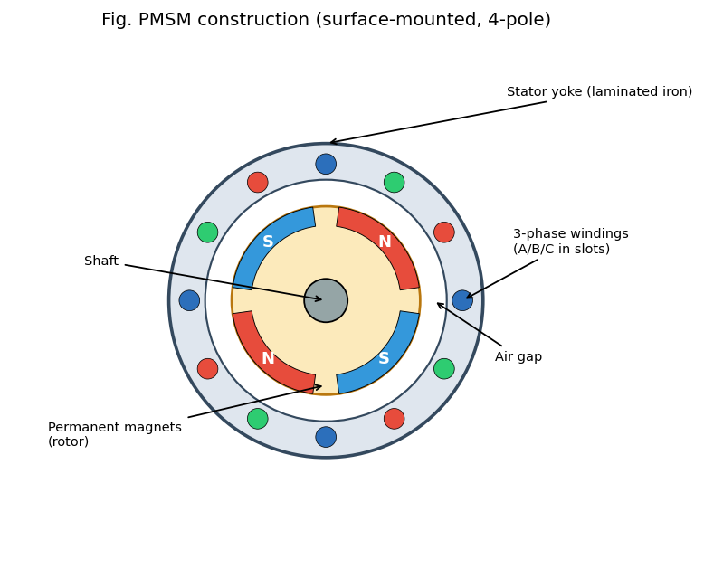

Two rotor topologies matter:

- **SPM (Surface-mounted PM):** magnets glued on the rotor surface; `L_d ≈ L_q`
  (no saliency); simple, used at low/medium speed.
- **IPM (Interior PM):** magnets buried inside the rotor; `L_d ≠ L_q` gives extra
  **reluctance torque** and a wide field-weakening range (preferred in EV traction).

### 2.2 Operating principle — synchronous rotation

When the three stator phases are fed with balanced sinusoidal currents 120°
apart, their magneto-motive forces add up to a **rotating magnetic field** whose
speed is set by the supply frequency and pole pairs, `n_s = 120·f / P` (rpm). The
rotor magnets **lock onto** this rotating field and turn **in synchronism** with it
— hence *synchronous* motor (Fig. 2). Unlike an induction motor there is **no
slip** and **no rotor current**, which is the root of the PMSM's high efficiency.

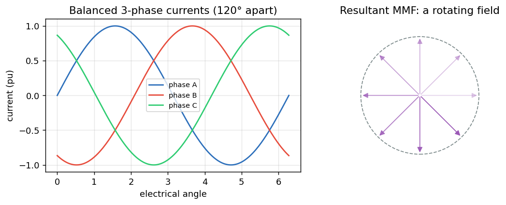

### 2.3 Electromagnetic torque and the d–q frame

Controlling an AC motor directly in the three-phase (abc) frame is hard because
everything is sinusoidal and coupled. The **Clarke** transform collapses abc → two
orthogonal stationary axes (αβ); the **Park** transform rotates αβ → a frame that
spins with the rotor (d–q), where the sinusoids become **DC quantities**:

- **d-axis (direct):** aligned with the rotor flux. In a PMSM we usually force
  `i_d ≈ 0` (the magnets already provide the flux).
- **q-axis (quadrature):** perpendicular to the flux; torque is proportional to it,
  `T ≈ (3/2)·P·λ_m·i_q`. So **i_q is the "torque knob."**

This decoupling (flux and torque made orthogonal, exactly as in a DC motor) is
what makes high-performance PMSM control possible.

### 2.4 Back-EMF: sinusoidal (and why it matters)

A spinning rotor induces a **back-EMF** in the stator. Its shape distinguishes the
PMSM (sinusoidal) from the BLDC (trapezoidal) (Fig. 3). The sinusoidal back-EMF is
why PMSM drives use sinusoidal currents and **Field-Oriented Control**, and why
**time–frequency (wavelet) analysis** of the current is so natural — the healthy
signal is a clean fundamental, and faults perturb it in characteristic ways.

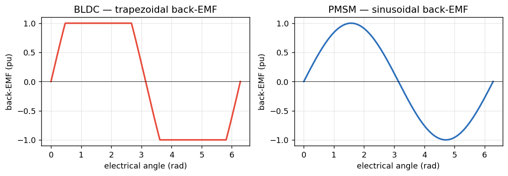

### 2.5 Torque–speed envelope

Below base speed the drive holds **constant torque**; above it, the back-EMF would
exceed the supply, so the controller injects negative `i_d` to **weaken the field**
and runs at **constant power** (Fig. 4). Operating point (load, speed) strongly
affects the measured signals — a key reason fixed-threshold fault detectors
struggle and learned features help.

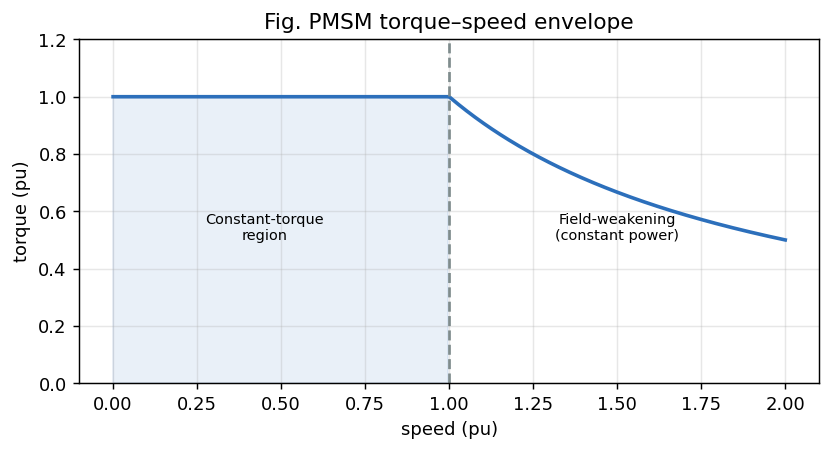

---

## 3. PMSM vs its relatives (PMDC, BLDC, induction)

Understanding *why* the PMSM was chosen requires comparing it with neighbouring
machines (Fig. 5):

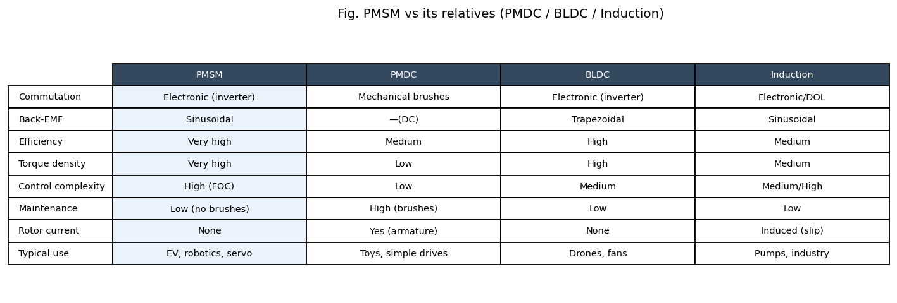

- **PMDC (brushed DC):** simplest control (voltage = speed), but mechanical
  **brushes/commutator** wear out, spark, and need maintenance; lower efficiency.
  The PMSM is essentially "a PMDC turned inside-out" with *electronic* commutation
  — same easy torque control, no brushes.
- **BLDC:** also PM rotor + electronic commutation, but **trapezoidal** back-EMF,
  driven with six-step square currents → higher torque ripple, simpler/cheaper
  control. PMSM (sinusoidal + FOC) gives smoother torque and higher efficiency —
  better for servo/traction.
- **Induction motor:** rugged and cheap, no magnets, but relies on **rotor slip
  and induced rotor current** → rotor copper losses and lower efficiency/torque
  density. Dominant in fixed-speed industrial pumps/fans.

**Summary:** the PMSM combines the DC motor's easy, decoupled torque control with
brushless reliability and the highest efficiency and torque density — which is why
it dominates EVs, robotics, and high-performance servo drives, and why its health
monitoring is economically important.

---

## 4. The control / drive system

A PMSM almost never runs "across the line"; it is driven by a **power-electronic
inverter** under **Field-Oriented Control** (Fig. 6).

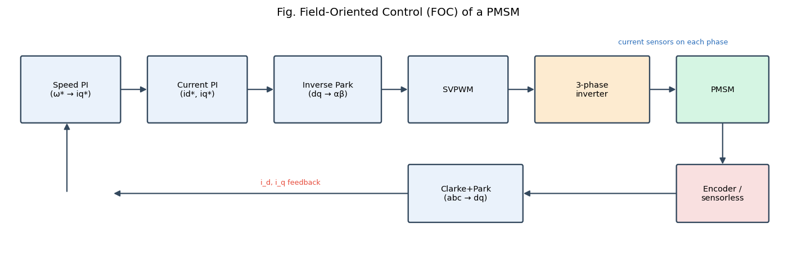

The loop, outer to inner:

1. **Speed controller (PI):** compares commanded vs measured speed → produces the
   torque command `i_q*` (with `i_d* ≈ 0`).
2. **Current controllers (PI):** regulate `i_d`, `i_q` to their references using
   the measured phase currents transformed into the d–q frame (Clarke + Park).
3. **Inverse Park + SVPWM:** convert the d–q voltage demands back to three-phase
   and compute the switching pattern.
4. **Three-phase voltage-source inverter (Fig. 7):** six power switches
   (IGBT/MOSFET) chop the DC bus to synthesise the desired sinusoidal voltages.
5. **Rotor position** from an **encoder/resolver** (or a **sensorless** estimator)
   closes the Park transform and the speed loop.

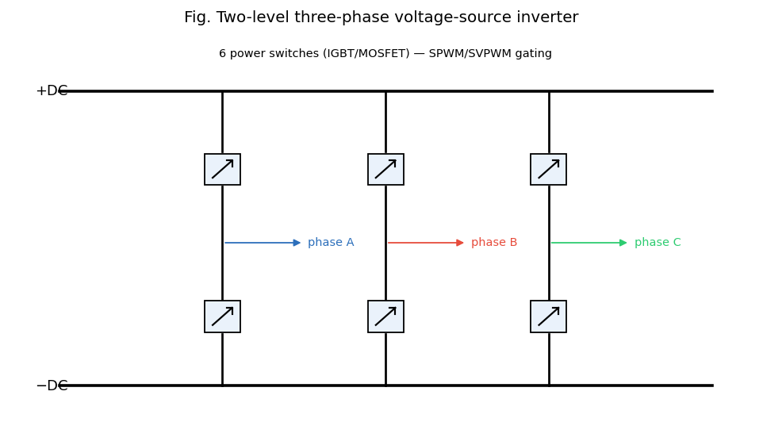

**Why the controller matters for diagnosis (important):** the current control loop
is *designed to reject disturbances*. When a fault perturbs the current, the PI
controllers partially **cancel** that perturbation to keep `i_d, i_q` on target —
so the fault signature in the **stator current is attenuated**. The **vibration**
signal is outside this loop and responds directly to the fault. This is the
physical reason our results show **vibration ≫ current** for inter-turn detection.

---

## 5. PMSM faults — one by one

Machine faults are grouped as **electrical** (≈ 35–40 %, mostly stator winding),
**mechanical** (bearings ≈ 40 %, the largest single category), and **magnetic**
(demagnetization). This project targets the stator electrical fault and treats the
others as context.

### 5.1 Inter-turn stator short circuit (ITSC) — primary fault

- **Cause:** insulation between adjacent turns of the same phase degrades from
  thermal ageing, voltage spikes (inverter dv/dt), moisture, vibration, or
  manufacturing defects.
- **Mechanism (Fig. 8):** the failed insulation creates a **shorted loop**. The
  rotating flux induces a large **circulating current** in those few turns (can be
  many times rated current), causing intense **local heating**.
- **Symptoms:** stator-current asymmetry, extra harmonics and side-bands, increased
  negative-sequence current, a localized hot-spot, and a characteristic vibration
  signature at twice the supply frequency.
- **Progression:** heat damages neighbouring insulation → the short grows turn-to
  -turn → phase-to-phase → ground fault → **complete winding burnout, often within
  minutes**. Early detection is therefore critical — exactly this project's goal.

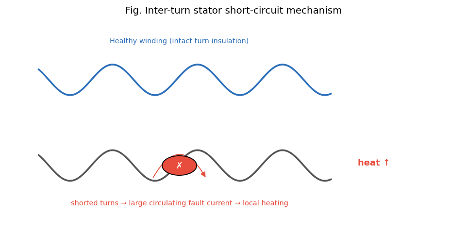

### 5.2 Demagnetization

- **Cause:** rotor magnets lose strength from over-temperature, ageing, or large
  demagnetising stator currents (e.g., a fault or aggressive field weakening).
- **Mechanism:** reduced PM flux `λ_m` lowers the back-EMF and torque constant.
- **Symptoms:** the drive draws **more current for the same torque**;
  **sub-harmonics** and side-bands at `f₀ ± k·f_r` (around the rotational
  frequency) appear; efficiency drops.
- **Note:** absent from the public real dataset, so represented synthetically here.

### 5.3 Overload / thermal stress

- **Cause:** sustained operation above rated load/torque, blocked cooling, high
  ambient temperature.
- **Mechanism/symptoms:** raised fundamental current, extra harmonics, and rising
  winding temperature that **accelerates insulation ageing** — i.e., overload is
  often the *precursor* to an inter-turn fault. A degraded operating *state* rather
  than a hard fault.

### 5.4 Mechanical faults (context)

- **Bearings** (the most common mechanical fault): wear/pitting produce vibration
  at characteristic defect frequencies and, via air-gap modulation, current
  side-bands.
- **Eccentricity / misalignment:** uneven air gap → side-bands around the
  fundamental. Addressed naturally by the same scalogram+CNN method on vibration,
  and listed as future work.

---

## 6. How these faults are detected today

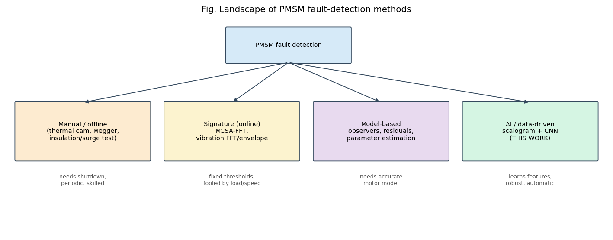

### 6.1 Manual / offline methods (machine stopped)
- **Visual + thermal imaging:** an infrared camera finds hot-spots — but only once
  heating is significant, and it needs access and a technician.
- **Insulation-resistance test (Megger) / polarization index:** DC megohmmeter
  checks winding-to-ground insulation. Catches gross degradation, **not** an
  incipient turn-to-turn short.
- **Surge / hi-pot test:** applies steep voltage to reveal turn insulation
  weakness — sensitive, but **offline** and potentially stressful to the winding.
- **Limitations:** require **shutdown**, are **periodic** (miss faults between
  inspections), and need skilled labour.

### 6.2 Online signature-based methods (machine running)
- **Motor Current Signature Analysis (MCSA):** take the FFT of the steady-state
  stator current and watch specific fault frequencies / side-bands (Fig. 10). The
  classic, sensor-free industrial method.
- **Vibration analysis:** accelerometer + FFT / **envelope analysis** for bearing
  and mechanical faults (ISO 10816 severity bands).
- **Park's Vector / instantaneous power / negative-sequence** approaches.
- **Limitations:** assume (near-)**stationary** operation; use **fixed thresholds**
  that are easily fooled by changing **load and speed**; the analyst must know
  *which* frequency to inspect; transients get **smeared** by the FFT.

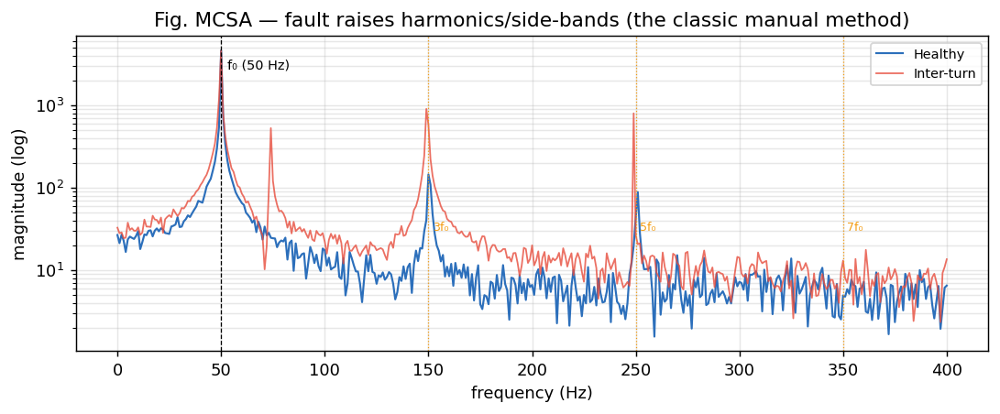

### 6.3 Model-based methods
- **State observers, parameter estimation, residual generation:** compare the real
  machine with a mathematical model; a growing residual flags a fault.
- **Limitations:** need an **accurate motor model** and parameters, which drift
  with temperature and ageing.

---

## 7. How the proposed method (CWT scalogram + CNN) improves things

The new approach replaces "pick a frequency and a threshold" with "**let the
network learn the fault's time–frequency fingerprint**":

1. **Captures non-stationary / transient signatures.** The Continuous Wavelet
   Transform keeps **time *and* frequency**, so a brief fault transient that the
   FFT would smear stays localized and visible (this is the core of §3–§4 of the
   main report).
2. **Automatic feature learning.** The CNN discovers the discriminative patterns in
   the scalogram itself — no expert must specify side-band frequencies.
3. **Robust to operating point.** Learned 2-D textures generalise across load/speed
   better than a single fixed amplitude threshold.
4. **Earlier, more sensitive detection.** Because subtle patterns are learned, the
   fault is flagged at lower severity than a fixed-threshold FFT alarm (Fig. 11) —
   buying time before burnout.
5. **Online, automatic, and sensor-reuse.** Current sensors already exist in every
   FOC drive; the method runs continuously with no shutdown.

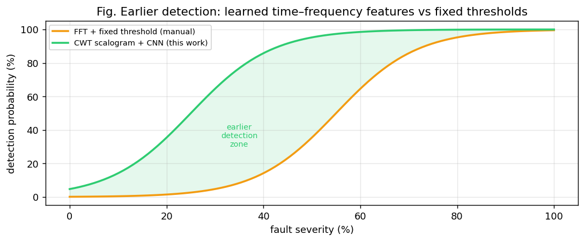

**Honest positioning.** It does not replace offline safety tests (Megger/surge
remain part of commissioning); it complements them as a **continuous, intelligent
online monitor**. Its current limitation is data diversity (few healthy
recordings), discussed in the results.

---

## 8. Standards, safety, and economics

- **Condition-monitoring standards:** ISO 20958 (electrical signal CM of machines),
  ISO 10816 / 20816 (vibration severity), IEEE 1415 (motor maintenance), IEC 60034
  (rotating machines).
- **Insulation classes** (IEC 60085: B/F/H) set the thermal limits whose violation
  drives inter-turn failure — linking overload (§5.3) to ITSC (§5.1).
- **Safety:** an undetected stator short is a fire/arc-flash hazard; early detection
  is a safety function, not just an economic one.
- **Economic case:** a low-cost software monitor reusing existing current sensors,
  preventing one burnout, typically pays for itself many times over in avoided
  downtime and motor-replacement cost.

---

## 9. Link to the rest of the report

This background motivates the pipeline detailed in the main report:
**signal → CWT scalogram (§3–§4) → CNN (§5) → diagnosis (§7–§8)**, with the
engineering insight that **vibration carries the strongest inter-turn signature**
(because the current loop suppresses it, §4) — exactly what the experimental
results confirm.

*All figures in this chapter are generated reproducibly by
`python/figures_engineering.py` into `docs/figures/`.*
