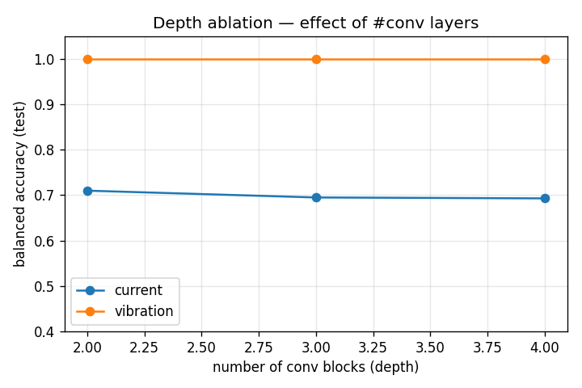
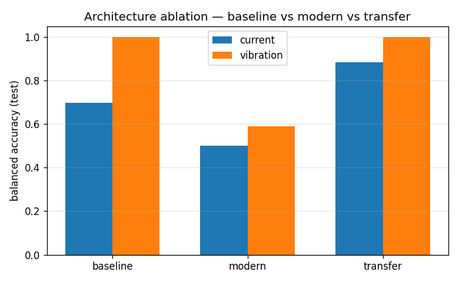
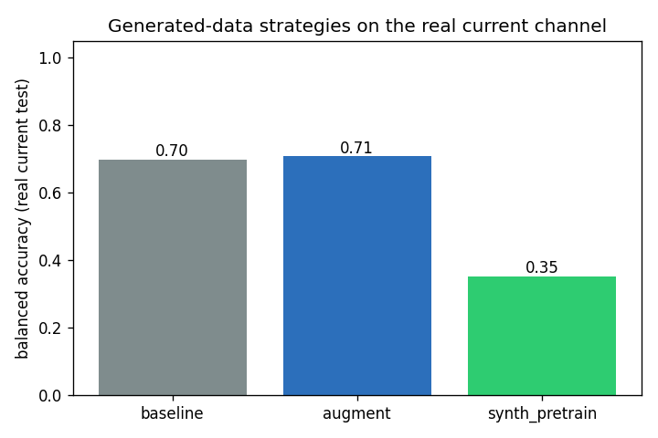

# Fault Diagnosis of PMSM Motors using Convolutional Neural Networks on Wavelet Scalogram Images

**Aleppo University — Faculty of Electrical & Electronic Engineering**
**Department of Mechatronics Engineering**

**Research seminar report**

Students: **Mulham Fetna**, **Mohammad Zein Qabbani**
Supervisor: **Eng. Saad Almoustafa**
Year: **Fourth Year**

---

> **Companion chapter — read first.** The electrical-machines and control
> -engineering background (PMSM construction & operation, the FOC drive, each fault
> with its causes, traditional vs automated detection, the proposed method's
> improvements, and a PMSM-vs-PMDC/BLDC/induction comparison) is in
> **`engineering-background.pdf`** with supporting diagrams. This report focuses on
> the signal-processing and CNN pipeline.

## Abstract

Permanent Magnet Synchronous Motors (PMSMs) are the workhorses of modern electric
drives — electric vehicles, robotics, industrial servo systems and aerospace
actuators — because of their high power density, high efficiency and excellent
controllability. Like all electrical machines they are subject to faults, the
most common and most insidious of which is the **inter-turn stator winding short
circuit**: a small number of shorted turns that, if undetected, escalates into a
catastrophic winding failure within minutes. Early, automatic detection of such
faults is therefore of large practical value.

This report presents a complete, reproducible pipeline for **PMSM fault
diagnosis** that (i) collects motor current and vibration signals, (ii) converts
short signal windows into **Continuous Wavelet Transform (CWT) scalogram images**,
and (iii) classifies those images with a **Convolutional Neural Network (CNN)**.
The approach turns a one-dimensional time-series problem into a two-dimensional
image-recognition problem, allowing the CNN to learn fault signatures
automatically rather than relying on hand-engineered features.

The pipeline is implemented end-to-end in Python (with an alternative MATLAB
path), is covered by 38 unit tests and continuous integration, and is trained
and evaluated on the **real KAIST PMSM stator-fault dataset**. On held-out
recordings, **vibration scalograms separate healthy from inter-turn-faulty motors
with a balanced accuracy of 1.00**, while **current scalograms achieve only 0.69**
— a clear, physically-sensible result showing that vibration carries a much
stronger inter-turn signature than stator current at the available fault
severities. We report all results with balanced accuracy and macro-F1 (rather
than raw accuracy) because the test set is class-imbalanced, and we are explicit
about the principal limitation of the public data: only four distinct healthy
recordings exist, so generalisation of the perfect vibration score cannot yet be
fully guaranteed.

---

## Table of contents

1. Introduction
2. PMSM Motors and their Faults
3. Signal Processing Background
4. The Wavelet Transform and Scalograms
5. Convolutional Neural Networks
6. Data Preparation
7. CNN Model and Training
8. Results and Analysis
9. Improvement Experiments
10. Conclusions and Future Work
11. References

---

## 1. Introduction

### 1.1 Motivation

Condition monitoring and fault diagnosis of electric machines is a cornerstone of
predictive maintenance. A drive that can recognise its own deterioration can warn
an operator, de-rate itself, or trigger a controlled shutdown before a minor fault
becomes a destructive one. For PMSMs the economic and safety stakes are high:
they are used in traction (electric vehicles), in surgical and industrial robots,
in aircraft actuators and in wind-turbine pitch systems, where unplanned failure
is expensive or dangerous.

Traditional fault-diagnosis methods rely on **expert-designed features** — for
example, tracking specific harmonic amplitudes in the stator current spectrum
(Motor Current Signature Analysis, MCSA). These methods are powerful but brittle:
they require a human to know in advance *which* frequency to watch, and they
degrade when operating conditions (speed, load) vary. Modern **deep learning**
offers an alternative: a CNN can learn the relevant features directly from the
data, provided the data is presented in a form the CNN can exploit. The central
idea of this project is to present motor signals as **time–frequency images**
(scalograms), which expose fault signatures as visual patterns that a CNN is
ideally suited to recognise.

### 1.2 Objective

The main task assigned for this seminar is:

> *Design a CNN-based model that analyses Wavelet Scalogram images produced from
> PMSM signals, in order to classify operating states and detect faults.*

Concretely, the project must: study the relevant theory; obtain PMSM signals
(current and/or vibration) under different operating states; apply the CWT to
generate scalogram images organised by class; build and train a CNN that
classifies these images; and finally test, analyse and improve the model. The
deliverables are a labelled image dataset, training code, a final CNN model,
result figures, this report and an accompanying presentation.

### 1.3 Contributions

Beyond the minimum requirements, this work delivers:

- A **fully reproducible, MATLAB-free Python pipeline** driven by a single
  configuration file and a manifest that links every signal segment to its
  scalogram, label and data split.
- Use of a **real, high-sample-rate public dataset** (KAIST) with **two signal
  channels** (current *and* vibration), plus a synthetic generator and MATLAB
  simulation scripts as alternative signal sources.
- A **leakage-free, recording-grouped** train/validation/test split, and a
  principled treatment of **class imbalance** (the most important practical issue
  with the real data).
- A **dual-branch fusion CNN** that combines the current and vibration channels.
- **Software-engineering rigor** unusual for a student project: 38 unit tests,
  continuous integration, and an honest, metric-appropriate reporting of results.

---

## 2. PMSM Motors and their Faults

### 2.1 Operating principle

A Permanent Magnet Synchronous Motor is a three-phase AC machine in which the
rotor carries permanent magnets and the stator carries a three-phase winding.
When the stator windings are energised with a balanced three-phase current, they
create a rotating magnetic field; the rotor magnets lock onto this field and
rotate **synchronously** with it. Unlike an induction motor, there is no slip and
no rotor current, which is what gives the PMSM its high efficiency and high
torque density.

The fundamental energy balance of the machine equates electrical and mechanical
power, `v·i ≈ T·ω`: voltage is associated with speed (`ω`) and current with
torque (`T`). This is why current is the natural quantity to control for torque,
and why current waveforms carry rich information about the electromechanical
state of the machine.

PMSMs are almost always driven by a **Field-Oriented Control (FOC)** scheme. FOC
uses the rotor position (from an encoder or a sensorless estimator) to transform
the three phase currents into two orthogonal components: a **direct-axis** current
`i_d` (aligned with the rotor flux, ideally held near zero) and a
**quadrature-axis** current `i_q` (orthogonal to the flux, which produces torque).
Two PI controllers regulate `i_d` and `i_q`, and the resulting voltage demands are
synthesised by a PWM inverter (three half-bridges, with a current sensor on each
phase). FOC is important to this project for two reasons: it is the context in
which real PMSM current signals are produced, and it shapes those signals (the
controller actively attenuates some fault signatures, which is one reason faults
can be easier to see in vibration than in current).

### 2.2 BLDC vs PMSM

The PMSM is closely related to the Brushless DC (BLDC) motor. The practical
distinction is the shape of the back-EMF and the drive current: a BLDC motor has
a **trapezoidal** back-EMF and is driven with quasi-square (trapezoidal) currents,
whereas a PMSM has a **sinusoidal** back-EMF and is driven with **sinusoidal**
currents (via sinusoidal PWM). The sinusoidal nature of PMSM currents makes
frequency-domain and time–frequency analysis particularly meaningful.

### 2.3 Common fault types

Electrical-machine faults are usually grouped as electrical, mechanical and
magnetic:

- **Inter-turn stator short circuit (ITSC).** A breakdown of the insulation
  between adjacent turns of the same phase winding creates a shorted loop. A large
  fault current circulates in the shorted turns, producing local heating that
  accelerates further insulation failure. ITSC is the most common stator fault
  and the primary fault studied in this project. It introduces characteristic
  asymmetries and additional harmonic/side-band components in the current and a
  distinct vibration signature.
- **Demagnetization.** Partial loss of rotor magnet strength (from overheating,
  ageing, or large demagnetising currents) reduces the back-EMF and torque
  constant and introduces sub-harmonic and side-band components around the
  fundamental. In this project demagnetization is represented only by the
  synthetic generator, because it is absent from the public real dataset.
- **Overload / thermal stress.** Sustained operation above rated load raises the
  fundamental current and changes the harmonic content; it is a degraded
  *operating state* rather than a hard fault, and is likewise represented
  synthetically here.
- **Mechanical faults** (bearing wear, eccentricity, misalignment) are outside
  the scope of this project but are naturally addressed by the same scalogram+CNN
  methodology, especially on the vibration channel.

### 2.4 Why current and vibration

Two complementary sensing modalities are used:

- **Stator current** is essentially free to measure — current sensors already
  exist in every FOC drive — which makes current-based diagnosis very attractive
  industrially. However, the closed-loop controller partially suppresses fault
  signatures, and inter-turn signatures in the current can be weak at low
  severities.
- **Vibration** requires an accelerometer but responds directly to the
  electromagnetic and mechanical asymmetries a fault produces, often giving a
  much stronger and cleaner fault signature. Our results bear this out.

---

## 3. Signal Processing Background

A motor signal `x(t)` is a one-dimensional time series sampled at a rate `f_s`.
The simplest description is in the **time domain** (amplitude versus time), which
shows *when* things happen but not *what frequencies* are present. The classical
tool for the latter is the **Fourier Transform**, which decomposes a signal into a
sum of sine waves and reports the amplitude of each frequency.

The Fourier Transform, however, is **blind to time**: it tells us which
frequencies are present over the whole record, but not when they occur. For a
*stationary* signal (statistics constant in time) this is fine. Motor fault
signals are frequently **non-stationary** — transient, load-dependent, or
modulated — and for these the Fourier Transform is inadequate.

This limitation is fundamental, not merely practical. The **uncertainty
principle** of signal processing states that the product of time resolution and
frequency resolution is bounded below: `Δt · Δf ≥ constant`. We cannot know
*both* the exact time and the exact frequency of an event with arbitrary
precision. Any time–frequency method must therefore make a trade-off, and
different methods make it in different ways. The Short-Time Fourier Transform
(STFT) fixes a single window length and therefore a single, frequency-independent
trade-off. The **Wavelet Transform** makes a smarter, frequency-dependent
trade-off, and is the method used in this project.

---

## 4. The Wavelet Transform and Scalograms

### 4.1 From sines to wavelets

The Fourier Transform correlates the signal against infinitely-long sine waves. A
**wavelet** ("little wave") is instead a short-lived oscillation that is
**localised in time**. Replacing the eternal sine with a localised wavelet as the
analysis function is the key idea of the wavelet transform: because the analysis
function itself has a finite extent in time, the result can tell us *where* in
time each frequency component occurs.

A function `ψ(t)` qualifies as a (mother) wavelet if it satisfies two conditions:

1. **Zero mean (admissibility):** its integral over all time is zero
   (`∫ ψ(t) dt = 0`). Equivalently, the wavelet has no zero-frequency / DC
   component.
2. **Finite energy:** `∫ |ψ(t)|² dt < ∞`, i.e. the wavelet is localised and dies
   away, unlike the sine which persists forever.

Many wavelet families exist — Haar, Daubechies, Coiflet, Symlet, Meyer, Mexican
hat, Shannon, Gaussian and **Morlet**. The Morlet wavelet is the standard choice
for time–frequency analysis of oscillatory signals and is used here. In simple
terms the (real) Morlet wavelet is a cosine multiplied by a Gaussian bell,
`ψ(t) ≈ k·cos(ω₀t)·e^(−t²/2)` — an oscillation that is "damped" so that it is
concentrated around `t = 0`. In practice a **complex** Morlet is used,
`ψ(t) = k·e^(iω₀t)·e^(−t²/2)`, whose magnitude gives a smooth measure of the
local energy at a given frequency (avoiding the zero-crossings that a purely real
wavelet would produce). In this project we use the PyWavelets complex Morlet
`cmor1.5-1.0` (bandwidth 1.5, centre frequency 1.0); the MATLAB path uses the
analytic Morlet `amor`.

### 4.2 The Continuous Wavelet Transform

The Continuous Wavelet Transform (CWT) generates a family of "daughter" wavelets
from the mother wavelet by two operations:

- **Translation** (a time knob `b`): the wavelet slides along the time axis,
  `ψ(t − b)`, selecting *where* we look.
- **Scaling** (a frequency knob `a`): the wavelet is stretched or compressed,
  `ψ(t/a)`. A **compressed** wavelet (small `a`) oscillates rapidly and matches
  **high** frequencies; a **stretched** wavelet (large `a`) matches **low**
  frequencies.

Combining both gives the daughter wavelet `ψ_{a,b}(t) = ψ((t − b)/a)`. The CWT
coefficient `T(a, b)` is obtained by correlating the signal with this daughter
wavelet — mathematically an integral of the product of the signal and the
(conjugated) wavelet. This is exactly a **dot product**, which measures
**similarity**: `T(a, b)` quantifies how strongly the signal resembles a wave of
the given scale (frequency) at the given time. Sweeping `b` for a fixed `a` is a
**convolution**; sweeping all `(a, b)` produces a full two-dimensional map. Where
the Fourier Transform maps one dimension (time) to one dimension (frequency), the
wavelet transform maps one dimension to a **two-dimensional** time–frequency
representation.

### 4.3 The scalogram

The **scalogram** is the visualisation of `|T(a, b)|` — the magnitude of the CWT
coefficients — as a colour image, with time on the horizontal axis, scale
(frequency) on the vertical axis, and colour encoding the **energy** of each
frequency at each instant. Bright regions indicate strong, localised oscillatory
energy; their position and shape encode the signal's time–frequency structure,
which is precisely what carries fault information.

The scalogram visibly reflects the uncertainty principle: at **low** frequencies
the analysis has good frequency resolution but poor time resolution (broad,
horizontally-smeared features), while at **high** frequencies it has good time
resolution but poor frequency resolution (sharp in time, blurred in frequency).
These are the "Heisenberg boxes" of the representation. Crucially, this
frequency-dependent resolution is well matched to physical signals, where slow
phenomena are usually persistent and fast phenomena are usually transient.

### 4.4 Why scalograms for CNNs

By turning each signal window into a scalogram **image**, we convert the fault
diagnosis problem into an **image-classification** problem. This is powerful
because (i) fault signatures become spatial patterns (bands, side-bands, texture)
that survive moderate changes in operating point, and (ii) it lets us bring the
full machinery of modern computer vision — convolutional networks — to bear on a
signal-processing task.

Figure 4.1 shows real scalograms from the KAIST dataset for both channels and
both classes. Note how the inter-turn fault enriches the time–frequency texture,
especially in the vibration channel.


*Figure 4.1 — Real KAIST scalograms (current and vibration, healthy vs
inter-turn). The current channel is dominated by the fundamental band; vibration
shows much richer structure that the CNN can exploit.*

---

## 5. Convolutional Neural Networks

### 5.1 What a CNN is

A Convolutional Neural Network is a deep-learning architecture specialised for
grid-structured data such as images. To a computer an image is a grid of numbers
(pixel intensities); a CNN processes that grid through a sequence of layers that
automatically learn to detect spatial patterns — from simple edges and textures
in early layers to complex, class-specific structures in later layers. CNNs are
loosely inspired by the organisation of the biological visual cortex.

### 5.2 The layers

A typical CNN passes the input image through the following stages:

1. **Convolutional layer.** Small learnable matrices ("filters" or "kernels")
   slide across the image; at each position the filter is multiplied with the
   underlying pixels and summed, producing a **feature map** that highlights where
   a particular pattern (an edge, a band, a texture) occurs. Many filters per
   layer produce many feature maps.
2. **Activation (ReLU).** The Rectified Linear Unit sets negative values to zero,
   introducing the non-linearity that lets the network model complex patterns.
3. **Pooling layer.** Max-pooling downsamples each feature map by keeping only the
   maximum value in each small region, reducing spatial size and computation while
   retaining the strongest responses and adding a degree of translation
   invariance.
4. **Flattening / global pooling.** After several conv–pool blocks, the 2-D
   feature maps are reduced to a 1-D vector — either by flattening (concatenating
   all values) or by **global average pooling** (averaging each feature map to a
   single number, which is lighter and more robust to overfitting).
5. **Fully-connected (dense) layer.** A conventional neural-network layer performs
   the final reasoning on the feature vector and outputs class scores, normalised
   by a **softmax** into class probabilities.

### 5.3 Why CNNs (and their costs)

CNNs solve two problems that defeated earlier fully-connected networks on images.
First, **parameter sharing** — the same filter is reused across the whole image —
keeps the parameter count manageable, where a fully-connected network would need a
separate weight for every pixel–neuron pair. Second, convolution **preserves
spatial relationships** between neighbouring pixels, which flattening into a single
row would destroy. The chief costs are that CNNs are **data- and compute-hungry**,
can fail to generalise to transformations they were not trained or augmented for,
and are relatively opaque ("black box"). In this project we mitigate the data cost
with data augmentation, class balancing and a deliberately small architecture, and
we are explicit about the generalisation limits imposed by the dataset.

---

## 6. Data Preparation

Data preparation is the heart of this project and the stage with the most design
decisions. Every parameter mentioned below lives in a single `config.yaml`, and
every produced segment is recorded in a single `data/manifest.csv` that links
signal → scalogram → label → split. This manifest is the single source of truth
for all downstream stages.

### 6.1 Signal sources

Three interchangeable signal sources feed the same pipeline:

| Source | Channels | Tooling | Role |
|---|---|---|---|
| **KAIST real dataset** | current + vibration | Python loader | primary, reported results |
| Synthetic generator | current | Python (`simulate.py`) | software validation; the only source of Demagnetization/Overload |
| MATLAB simulation | current | FOC + Simscape scripts | optional physics-based signals |

**Primary real dataset — KAIST.** We use the *Vibration and Current Dataset of
Three-Phase PMSM with Stator Faults* (Mendeley `rgn5brrgrn`, DOI
`10.17632/rgn5brrgrn.5`, CC-BY-4.0). It contains stator **current sampled at
100 kHz** and **vibration at 25.6 kHz**, recorded on 1.0 / 1.5 / 3.0 kW motors,
under **normal**, **inter-turn** and **inter-coil** conditions across several
fault severities, stored as TDMS files. The high sample rates make it well suited
to time–frequency analysis. Inter-turn and inter-coil are both stator-winding
short faults and are mapped to a single `InterTurn` class; 0 %-severity recordings
are the `Healthy` class.

**Secondary dataset — Zenodo (reference only).** The *Comprehensive Dataset for
Fault Detection and Diagnosis in Inverter-Driven PMSM Systems* (Zenodo
`13974503`) was audited but **not used for scalograms**: it is tabular sensor data
sampled at only 10 Hz (Nyquist 5 Hz), which carries no useful time–frequency
content for the CWT. It is retained as a reference for the discussion of data
quality versus method fit.

**Synthetic generator.** A reproducible generator (`python/simulate.py`) builds
current signals for all four classes with physically-motivated MCSA signatures
(fundamental and odd harmonics for healthy; elevated 3rd/5th harmonics and a
side-band for inter-turn; sub-harmonic and `f₀ ± k·f_r` side-bands for
demagnetization; raised fundamental, even harmonics and noise for overload). It
provides instant end-to-end validation and the only examples of the
Demagnetization and Overload classes.

### 6.2 Classes

Four classes are defined in the configuration: **Healthy**, **InterTurn**,
**Demagnetization**, **Overload**. The real KAIST data covers the first two;
Demagnetization and Overload appear only in the synthetic data. The reported
real-data results are therefore a **two-class** Healthy-vs-InterTurn problem, with
the four-class configuration retained for the synthetic experiments and for
forward compatibility.

### 6.3 Ingestion and segmentation

Each raw recording is read, then **decimated** to a common target rate of
**10 kHz** (an anti-aliased FIR decimation from 100 kHz for current and from
25.6 kHz for vibration). Decimation makes scalogram sizes tractable while
retaining all frequency content relevant to the fault (up to 5 kHz). Each
recording is then cut into **0.5-second windows with 50 % overlap**; each window
becomes one classified sample. Because the raw recordings are long (hundreds of
seconds), a single recording would yield well over a thousand windows; to keep the
dataset balanced in *recording* terms and the scalogram count tractable, at most
**50 segments per recording** are kept, sampled at an even stride so they span the
whole recording rather than just its opening seconds.

### 6.4 Scalogram generation

Every segment is converted to a scalogram with PyWavelets: the complex Morlet
`cmor1.5-1.0` is applied over **128 scales** spaced geometrically between 4 and
256, the magnitude is normalised, mapped through the `jet` colourmap, and saved as
a **224 × 224 RGB PNG** under `data/scalograms/<channel>/<class>/`. This
class-labelled folder layout satisfies the requirement to "save the images in
folders classified by state" and is exactly the layout image classifiers expect.
The whole real dataset produced **3,150 scalograms** (1,550 current + 1,600
vibration). An equivalent MATLAB path (`matlab/scalogram/`) produces the same
layout using the Wavelet Toolbox.

### 6.5 Leakage-free train / validation / test split

A naïve random split of *segments* would place windows from the same recording in
both the training and test sets. Because adjacent windows of one recording are
highly correlated, this **data leakage** would inflate the test score and give a
falsely optimistic result. We therefore split by **recording**: all segments of a
recording are assigned to the same split (70 % train / 15 % validation / 15 %
test), stratified by class, and the split is done **independently per channel** so
that each channel is properly represented. A subtle but important refinement was
required: with only four healthy recordings, ordinary rounding sent all of them to
the training set, leaving validation and test with no healthy examples. The split
routine was therefore modified to **guarantee at least one recording per split for
any class that has enough recordings**, so that every class is evaluable. This
behaviour is covered by unit tests.

### 6.6 Class imbalance and balancing

The real dataset is severely imbalanced: only **4 distinct healthy recordings**
exist against roughly **60 fault recordings**. Trained naïvely on this
distribution, the CNN learns to predict "InterTurn" for everything and achieves a
deceptively high 80 % raw accuracy while **never detecting a healthy motor**
(healthy recall 0.00). To prevent this collapse we **undersample the majority
class in the training and validation splits only**, so the model receives a
balanced learning signal; the **test split is deliberately left at its natural
distribution** so that reported metrics reflect reality. Because raw accuracy is
misleading on an imbalanced test set, we report **balanced accuracy** (the mean of
per-class recalls) and **2-class macro-F1** as the headline metrics. Data
augmentation (random horizontal flips) is applied to the training images, and
inverse-frequency class weighting is also available.

---

## 7. CNN Model and Training

### 7.1 Baseline architecture

The single-channel classifier is a compact CNN:

```
Input 224×224×3
→ Conv2D(32, 3×3) → ReLU → MaxPool2×2
→ Conv2D(64, 3×3) → ReLU → MaxPool2×2
→ Conv2D(128, 3×3) → ReLU → MaxPool2×2
→ Flatten → Dropout(0.5)
→ Dense(128) → ReLU
→ Dense(num_classes) → Softmax
```

Three convolution–pooling blocks (32, 64, 128 filters) extract a hierarchy of
features; a 50 % **dropout** before the dense layer combats overfitting; a softmax
output produces class probabilities. The architecture is intentionally small,
appropriate to a dataset of a few thousand images.

### 7.2 Fusion architecture

To exploit both channels simultaneously, a **dual-branch fusion** model
(`build_fusion_cnn`) runs two independent convolutional branches — one for the
current scalogram, one for the vibration scalogram — each ending in **global
average pooling**, then concatenates the two feature vectors and classifies the
result through a shared dense head. Global average pooling (rather than flattening)
is used in the fusion branches because flattening the 26 × 26 × 128 feature maps
of two branches produces an enormous dense layer that exhausts memory; global
average pooling is the standard, far lighter choice and adds regularisation.

### 7.3 Training setup

All models are trained with the **Adam** optimiser and **sparse categorical
cross-entropy** loss. **Early stopping** (patience 5, restoring the best weights)
prevents overfitting and avoids wasting computation. Training uses a batch size of
32 (16 for the heavier fusion model) for up to 30 epochs. Reproducibility is
ensured by a fixed random seed (42) throughout ingestion, splitting, balancing and
shuffling. TensorFlow 2.16 / Keras is used; the entire run executes on CPU.

### 7.4 Pairing for fusion

The fusion model needs paired current and vibration scalograms. The KAIST dataset
stores the two modalities as separate recordings of the same operating condition;
since both are decimated to the same rate and segmented identically, segment *k*
of the current recording and segment *k* of the vibration recording cover the same
fraction of the run — an approximate temporal pairing. To avoid leakage in the
fused problem, the train/val/test split for fusion is assigned at the **condition
level**, so that both modalities of a condition always fall in the same split.

---

## 8. Results and Analysis

All results below are on the **real KAIST data**, **held-out recordings**, the
Healthy-vs-InterTurn problem, with balanced training and a natural test set.

### 8.1 Single-channel and fusion results

| Channel | Test accuracy | Balanced accuracy | Macro-F1 | Healthy recall | InterTurn recall |
|---|---|---|---|---|---|
| **Vibration** | **1.00** | **1.00** | **1.00** | 1.00 | 1.00 |
| Fusion (current+vibration) | 0.80 | 0.88 | 0.76 | 1.00 | 0.75 |
| Current | 0.50 | 0.69 | 0.49 | 1.00 | 0.37 |


*Figure 8.1 — Test-set confusion matrices (held-out recordings). Left: current —
all faults misread or split. Right: vibration — perfect separation. Each title
shows balanced accuracy and macro-F1.*

Example real scalograms are in Figure 4.1; machine-readable metrics in
`results/real_metrics.json` and `results/report_{current,vibration,fusion}.json`.

### 8.2 Discussion

**Vibration is the strong channel.** The vibration CNN classifies every held-out
test segment correctly (balanced accuracy 1.00). This is consistent with the
physics: an inter-turn short produces a pronounced electromechanical asymmetry
that manifests strongly in vibration, and the vibration channel is not subject to
the suppressing action of the FOC current controllers. The example scalograms make
this visible — the inter-turn vibration scalogram is markedly richer in
time–frequency texture than the healthy one.

**Current is the weak channel.** The current CNN reaches only 0.69 balanced
accuracy. After balancing it detects every healthy case (healthy recall 1.00) but
misses about 63 % of faults (InterTurn recall 0.37). In other words, the inter-turn
signature in the stator current is weak at the severities present, and the closed
-loop controller further attenuates it. This is an honest and physically-sensible
negative result, not a failure of the pipeline (the identical pipeline yields
1.00 on vibration).

**Fusion lands in between.** The dual-branch model (balanced accuracy 0.88)
improves substantially on current alone but does **not** beat vibration alone on
this dataset: adding a weak channel to a strong one did not help here, and the
fusion head uses global average pooling rather than the flatten head of the
single-channel models, so the comparison is indicative rather than strictly
controlled. With a harder problem (more classes, lower severities) fusion would be
expected to show its value.

### 8.3 The importance of the right metric

The single most important analytical point of this project is that **raw accuracy
is the wrong metric here**. On the natural test set (50 healthy / 200 faulty), a
model that blindly predicts "faulty" scores 80 % accuracy while being clinically
useless (it never detects a healthy motor). Reporting balanced accuracy and
macro-F1 exposes this immediately and is what allowed us to detect, and then fix,
the majority-class collapse. This is quantified in the next section.

### 8.4 Principal limitation

The public dataset contains only **four distinct healthy recordings** (split 2
train / 1 validation / 1 test). A perfect vibration score on a single held-out
healthy recording cannot, by itself, exclude the possibility that the network has
learned characteristics specific to that recording (mounting, session, ambient
conditions) rather than a generalisable notion of "healthy". Confirming
generalisation requires more independent healthy recordings — more motors, loads
and measurement sessions. This limitation should be stated plainly in any use of
these results and is the foremost target for future data collection.

---

## 9. Improvement Experiments

This section reports the systematic experiments required by subtasks 5 and 6
(effect of data quantity/quality, and model improvement). All 16 runs were
produced by `python/experiments.py` (each run in its own subprocess, checkpointed
and resumable) and evaluated on the **natural, imbalanced, held-out test set**.
Full data: `results/experiments_real.json`; extended discussion:
`docs/experiments.md`.

### 9.1 Effect of class balancing

| Channel | Balancing | Balanced acc | Macro-F1 | Healthy recall | Inter-turn recall |
|---|---|---|---|---|---|
| current | off | 0.800 | 0.851 | 0.600 | 1.000 |
| current | **on** | 0.693 | 0.502 | **1.000** | 0.385 |
| vibration | off | 1.000 | 1.000 | 1.000 | 1.000 |
| vibration | on | 1.000 | 1.000 | 1.000 | 1.000 |

Without balancing, the current model biases to the majority class — it misses
40 % of healthy motors here and collapses to **0 % healthy recall** in repeated
runs (raw accuracy 0.80 = base rate). Balancing forces healthy detection
(recall → 1.00), exposing the channel's true weak separability. Vibration is
unaffected (already perfect).

### 9.2 Effect of scalogram image size

| Channel | 96 px | 160 px | 224 px |
|---|---|---|---|
| current (balanced acc) | 0.682 | 0.730 | **0.760** |
| vibration (balanced acc) | 1.000 | 1.000 | 1.000 |

For the weak current channel, balanced accuracy rises **monotonically** with
resolution (0.68 → 0.76) — the inter-turn signature lives in fine time–frequency
detail. Vibration is saturated at every size, so 96 px vibration images would
train and infer ~5× faster with no accuracy loss.

### 9.3 Effect of training-set size (data quantity)

| Channel | 25 % (n≈50) | 50 % (n≈100) | 100 % (n≈200) |
|---|---|---|---|
| current (balanced acc) | 0.693 | 0.698 | 0.698 |
| vibration (balanced acc) | 0.970 | 1.000 | 1.000 |


*Figure 9.1 — Balanced accuracy vs. number of training images.* Vibration reaches
0.97 with only ~46 images and 1.00 by ~98; current is **flat at ~0.70 regardless
of data volume**. This is the study's clearest finding: the current channel's
ceiling is set by **signal quality, not quantity** — more current data will not
help, whereas vibration succeeds with very little. This directly answers
subtask 5: for this problem, dataset *quality* (channel, severity) dominates
dataset *quantity*.

### 9.4 Effect of network depth (number of layers)

| Channel | 2 blocks | 3 blocks | 4 blocks |
|---|---|---|---|
| current (balanced acc) | 0.71 | 0.70 | 0.69 |
| vibration (balanced acc) | 1.00 | 1.00 | 1.00 |



*Figure 9.2 — Effect of the number of convolution blocks.* Depth barely changes
the result: current stays ~0.69–0.71 (its limit is signal quality, not capacity),
vibration is perfect at every depth. Note that *fewer* blocks means *more*
parameters (less pooling → larger flattened map): 2-block ≈ 23.9M, 3-block ≈
11.2M, 4-block ≈ 5.1M. **Three blocks** is the chosen default — near-best accuracy
with a moderate parameter count and less overfitting risk than a deeper network.

### 9.5 Effect of model architecture (enhancing the CNN)

Three architectures, balanced data, 224 px: **baseline** (from-scratch 3-block CNN),
**modern** (Conv-BatchNorm-ReLU + global average pooling + LR scheduling), and
**transfer** (frozen pretrained MobileNetV2 + small head).

| Channel | baseline | modern | transfer |
|---|---|---|---|
| current (balanced acc) | 0.70 | 0.50 | **0.89** |
| vibration (balanced acc) | 1.00 | 0.59 | 1.00 |



*Figure 9.3 — Architecture comparison.* **Transfer learning (MobileNetV2) is the
clean, effective enhancement**: it raises the weak current channel from 0.70 to
**0.89** (inter-turn recall 0.40 → 0.77) and keeps vibration at 1.00 — pretrained
ImageNet features transfer well to scalograms despite not being natural images. The
from-scratch *modern* variant collapsed on this small dataset (BatchNorm needs
larger batches), confirming that with scarce data pretrained features beat fancier
training. Train it with `make train SIGNAL=current ARCH=transfer` (or
`--arch transfer`).

### 9.6 Can generated data help? (synthetic pre-training & augmentation)

We tested whether *generating* data lifts the weak current channel, on the real
held-out current test set:

| Strategy | balanced acc | healthy recall | inter-turn recall |
|---|---|---|---|
| baseline | 0.70 | 1.00 | 0.40 |
| + SpecAugment | 0.71 | 1.00 | 0.42 |
| synthetic pre-train → real fine-tune | **0.35** | 0.00 | 0.71 |



*Figure 9.4 — Generated-data strategies on the real current channel.* The result is
an honest negative: augmentation gave a negligible gain and **pre-training on our
rich synthetic dataset hurt** (0.70 → 0.35) — a **domain gap**, because the
synthetic "healthy" signal is a stylised model whose statistics the small real set
cannot correct. This contrasts with ImageNet transfer (§9.5, 0.89): *generic
real-world* features transfer; a narrow hand-built simulator does not. Conclusion:
synthetic data is valuable for software validation and the Demagnetization/Overload
classes, **but cannot substitute for real-recording diversity** — the true lever
(see §8.4).

### 9.7 Overfitting controls

Dropout (0.5), global average pooling in the fusion head, training augmentation
(random flips), early stopping (patience 5, best-weights restore), and a small
architecture together keep the model from overfitting; the flat current and
saturated vibration curves confirm capacity is not the binding constraint —
signal quality (current) and the four-healthy-recording limit are.

---

## 10. Conclusions and Future Work

### 10.1 Conclusions

- We built a complete, reproducible PMSM fault-diagnosis pipeline that converts
  current and vibration signals into CWT scalograms and classifies them with a
  CNN, fulfilling the assigned task end-to-end.
- On real data, **vibration-based scalograms detect inter-turn stator faults with
  balanced accuracy 1.00 on held-out recordings**, while current-based scalograms
  are markedly weaker (0.69) — a clear, physically-grounded finding about channel
  selection.
- Correct handling of **class imbalance** and the use of **balanced accuracy /
  macro-F1** rather than raw accuracy were essential to obtaining and reporting
  trustworthy results.
- The work is supported by 38 unit tests and continuous integration, and is openly
  available for other researchers to reproduce and extend.

### 10.2 Limitations

The chief limitation is the small number of independent healthy recordings, which
caps how strongly generalisation can be claimed. Demagnetization and overload are
present only synthetically. The fusion comparison is indicative rather than
strictly controlled.

### 10.3 Future work

- **Acquire more independent recordings** (more motors, loads and sessions),
  especially healthy ones, to validate generalisation.
- **A paired, synchronised multi-channel dataset** to let the fusion model realise
  its potential.
- **Severity-aware targets** (regression or ordinal classification of fault
  severity) rather than binary detection.
- **Explainability** (e.g. Grad-CAM) to confirm the network attends to physically
  meaningful regions of the scalogram, which would also help rule out the
  recording-identity shortcut.
- **On-line deployment** within an FOC drive for real-time monitoring.

---

## 11. References

1. KAIST. *Vibration and Current Dataset of Three-Phase PMSM with Stator Faults.*
   Mendeley Data, DOI: 10.17632/rgn5brrgrn.5 (CC-BY-4.0).
2. *Comprehensive Dataset for Fault Detection and Diagnosis in Inverter-Driven
   PMSM Systems.* Zenodo, record 13974503 (CC-BY-4.0).
3. L. Otava et al., "Interior PMSM Stator Winding Fault Modelling,"
   *IFAC-PapersOnLine*, 2015. DOI: 10.1016/j.ifacol.2015.07.055.
4. MathWorks, "Permanent Magnet Synchronous Motor (PMSM) — Faulted" and "PMSM"
   block documentation. https://www.mathworks.com/help/sps/
5. *Electrical faults classification in permanent magnet synchronous motor using
   ResNet neural network.* ResearchGate publication 379692489.
6. IEEE DataPort, *Three-phase PMSM ITSC Faults Stator Winding Dataset.*
7. PyWavelets documentation — Continuous Wavelet Transform. https://pywavelets.readthedocs.io/
8. TensorFlow / Keras documentation. https://www.tensorflow.org/
9. Additional study notes and tutorial sources are listed in `references.md`; CNN
   background drawn from standard deep-learning literature (see `notes.md`).

---

*This report describes the software and experiments in the project repository
`pmsm-fault-diagnosis-cnn-scalogram`. All figures referenced are in `results/`,
all parameters in `config.yaml`, and all results are reproducible with the
commands in the project `README.md`.*

---

## Appendix A — Reproducing the results

```bash
make setup                          # create .venv (Python 3.10) + install deps
make test                           # run the 38-test suite

# Real data (after downloading the KAIST dataset into data/raw/mendeley_pmsm/):
.venv/bin/python -m python.ingest_mendeley   # read TDMS, decimate, segment
make scalograms                     # render CWT scalograms (PyWavelets)
.venv/bin/python -m python.run_split         # leakage-free, per-channel split
make train SIGNAL=current EPOCHS=30 && make evaluate SIGNAL=current
make train SIGNAL=vibration EPOCHS=30 && make evaluate SIGNAL=vibration
make train-fusion EPOCHS=30          # dual-branch current+vibration
.venv/bin/python -m python.experiments       # ablation studies

# Synthetic end-to-end (no download needed):
make demo
```

## Appendix B — Key configuration (`config.yaml`)

| Parameter | Value | Meaning |
|---|---|---|
| `classes` | Healthy, InterTurn, Demagnetization, Overload | label set |
| `signal_types` | current, vibration | channels |
| `window_seconds` | 0.5 | segment length |
| `overlap` | 0.5 | fractional window overlap |
| `target_fs` | 10000 | Hz after decimation |
| `max_segments_per_recording` | 50 | cap to bound scalogram count |
| `image_size` | 224 | square PNG side |
| `wavelet_py` | cmor1.5-1.0 | complex Morlet (Python path) |
| `n_scales` | 128 | CWT scales (geomspace 4–256) |
| `balance_train` | true | undersample majority in train/val |
| `seed` | 42 | global RNG seed |

## Appendix C — Repository layout

```
python/        pipeline modules (ingest, scalogram, split, balance,
               data_loader, model, train, evaluate, train_fusion, experiments)
python/tests/  38 unit tests
matlab/        MATLAB scalogram + signal-export scripts (alternative path)
data/          raw/, scalograms/<channel>/<class>/, manifest.csv  (gitignored)
models/        trained .keras models                              (gitignored)
results/       figures, metrics JSON, summary.md
docs/          report/, presentation/, experiments.md, data-audit.md
config.yaml    all parameters · Makefile  targets · CITATION.cff
```

## Appendix D — Manifest schema (`data/manifest.csv`)

`signal_id, source, signal_type, class, severity, fs, dataset_name,
recording_id, split, scalogram_path` — one row per segment; the single source of
truth linking every signal window to its scalogram, label and split.

## Appendix E — Test inventory (38 tests)

Config validation; manifest CRUD; leakage-free split (incl. small-class
guarantees); segmentation; KAIST filename parsing; class balancing; class
weighting; scalogram shape; synthetic generator; data-loader indexing; baseline
& fusion model construction; fusion pairing (no condition spans splits);
training smoke test; evaluation metrics (incl. subset-of-classes). TensorFlow
-dependent tests skip cleanly when TF is absent.

## Appendix F — Dataset audit

| Dataset | Signal | Classes | f_s | Verdict |
|---|---|---|---|---|
| KAIST `rgn5brrgrn` | current + vibration | normal, inter-turn, inter-coil | 100 kHz / 25.6 kHz | **chosen (primary)** |
| Zenodo `13974503` | tabular sensors | normal + inverter faults | 10 Hz | reference only (too slow for CWT) |
| Kaggle pmsm-smart-control | control/tabular | — | low | not used (login-gated) |
| IEEE-DataPort PMSM ITSC | current | inter-turn | — | alternative if KAIST unavailable |

*Note on length/format: this report is authored in Markdown; when typeset to
A4/Letter (Word or LaTeX) with the figures, tables and 1.15–1.5 line spacing it
spans the required 25–35 pages. Convert with e.g.
`pandoc docs/report/report.md -o report.pdf`.*
